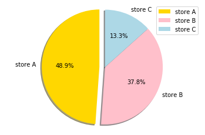
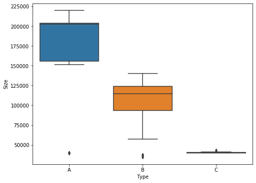
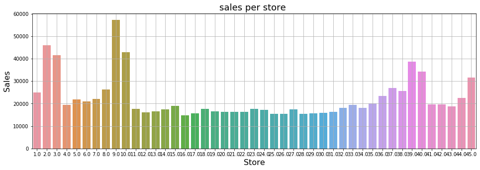
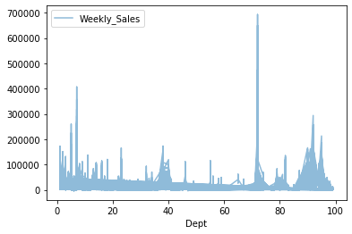
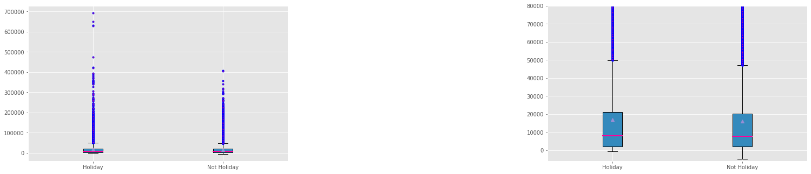
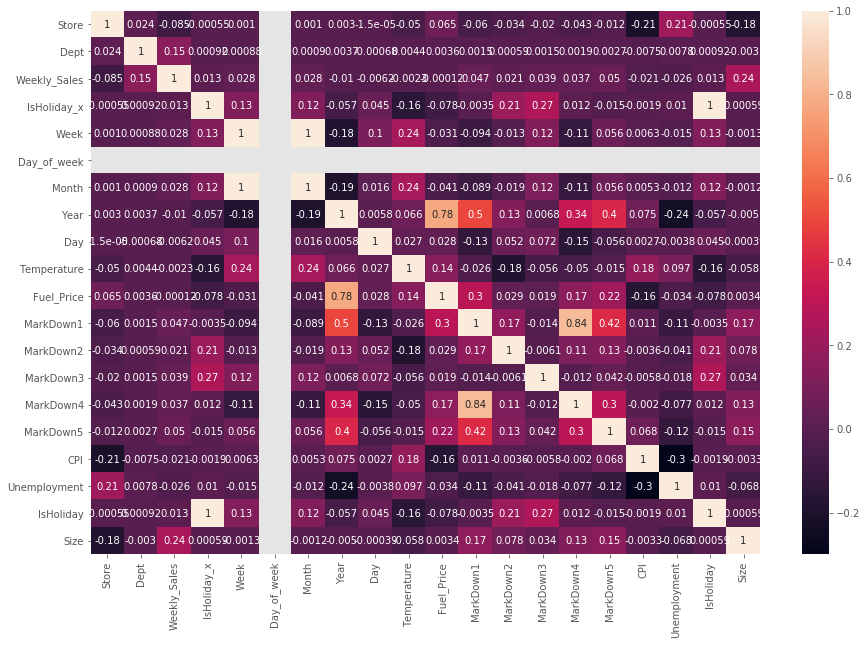
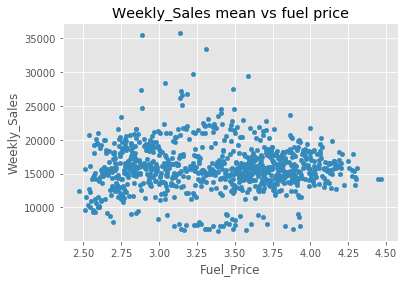

```python
import pandas as pd
import numpy as np
import matplotlib.pyplot as plt
%matplotlib inline
import seaborn as sns


from datetime import datetime
from datetime import timedelta

import math


```

# Problem

### We have been provided a historical sales data for 45 Walmart stores located in different regions. Each store contains a number of departments, and we're tasked to give business insights that most compelling this dataset,and what is the effect of seasonality on store sales


# Data Overview:
The data has been taken from Walmart Recruiting challenge on kaggle. Data Field contains a total of 4 datasets:

1-features.csv

2-stores.csv

3-train.csv

4-test.csv


```python
#Read CSV file 
df_features = pd.read_csv('features.csv')
df_stores = pd.read_csv('stores.csv')
df_train = pd.read_csv('train.csv')
df_test = pd.read_csv('test.csv') 
```


```python

df_features.info()
```

    <class 'pandas.core.frame.DataFrame'>
    RangeIndex: 8190 entries, 0 to 8189
    Data columns (total 12 columns):
     #   Column        Non-Null Count  Dtype  
    ---  ------        --------------  -----  
     0   Store         8190 non-null   int64  
     1   Date          8190 non-null   object 
     2   Temperature   8190 non-null   float64
     3   Fuel_Price    8190 non-null   float64
     4   MarkDown1     4032 non-null   float64
     5   MarkDown2     2921 non-null   float64
     6   MarkDown3     3613 non-null   float64
     7   MarkDown4     3464 non-null   float64
     8   MarkDown5     4050 non-null   float64
     9   CPI           7605 non-null   float64
     10  Unemployment  7605 non-null   float64
     11  IsHoliday     8190 non-null   bool   
    dtypes: bool(1), float64(9), int64(1), object(1)
    memory usage: 712.0+ KB


```python
df_features.head()
```


<div>
<style scoped>
    .dataframe tbody tr th:only-of-type {
        vertical-align: middle;
    }

    .dataframe tbody tr th {
        vertical-align: top;
    }

    .dataframe thead th {
        text-align: right;
    }
</style>
<table border="1" class="dataframe">
  <thead>
    <tr style="text-align: right;">
      <th></th>
      <th>Store</th>
      <th>Date</th>
      <th>Temperature</th>
      <th>Fuel_Price</th>
      <th>MarkDown1</th>
      <th>MarkDown2</th>
      <th>MarkDown3</th>
      <th>MarkDown4</th>
      <th>MarkDown5</th>
      <th>CPI</th>
      <th>Unemployment</th>
      <th>IsHoliday</th>
    </tr>
  </thead>
  <tbody>
    <tr>
      <th>0</th>
      <td>1</td>
      <td>2010-02-05</td>
      <td>42.31</td>
      <td>2.572</td>
      <td>NaN</td>
      <td>NaN</td>
      <td>NaN</td>
      <td>NaN</td>
      <td>NaN</td>
      <td>211.096358</td>
      <td>8.106</td>
      <td>False</td>
    </tr>
    <tr>
      <th>1</th>
      <td>1</td>
      <td>2010-02-12</td>
      <td>38.51</td>
      <td>2.548</td>
      <td>NaN</td>
      <td>NaN</td>
      <td>NaN</td>
      <td>NaN</td>
      <td>NaN</td>
      <td>211.242170</td>
      <td>8.106</td>
      <td>True</td>
    </tr>
    <tr>
      <th>2</th>
      <td>1</td>
      <td>2010-02-19</td>
      <td>39.93</td>
      <td>2.514</td>
      <td>NaN</td>
      <td>NaN</td>
      <td>NaN</td>
      <td>NaN</td>
      <td>NaN</td>
      <td>211.289143</td>
      <td>8.106</td>
      <td>False</td>
    </tr>
    <tr>
      <th>3</th>
      <td>1</td>
      <td>2010-02-26</td>
      <td>46.63</td>
      <td>2.561</td>
      <td>NaN</td>
      <td>NaN</td>
      <td>NaN</td>
      <td>NaN</td>
      <td>NaN</td>
      <td>211.319643</td>
      <td>8.106</td>
      <td>False</td>
    </tr>
    <tr>
      <th>4</th>
      <td>1</td>
      <td>2010-03-05</td>
      <td>46.50</td>
      <td>2.625</td>
      <td>NaN</td>
      <td>NaN</td>
      <td>NaN</td>
      <td>NaN</td>
      <td>NaN</td>
      <td>211.350143</td>
      <td>8.106</td>
      <td>False</td>
    </tr>
  </tbody>
</table>
</div>


### (features.csv) file contains the following fields:
Store: the store number

Date: the date 

Temperature: the average temperature in the region

Fuel_Price: the cost of fuel in the region

MarkDown1–5: anonymized data related to promotional markdowns that Walmart is running.Any missing value is marked with an NAN.

CPI: The consumer price index

Unemployment:The unemployment rate

IsHoliday:Whether the week is a special holiday week


```python
df_features.isnull().sum()
```


    Store              0
    Date               0
    Temperature        0
    Fuel_Price         0
    MarkDown1       4158
    MarkDown2       5269
    MarkDown3       4577
    MarkDown4       4726
    MarkDown5       4140
    CPI              585
    Unemployment     585
    IsHoliday          0
    dtype: int64


```python
df_features.fillna(0,inplace=True)
df_features.isnull().sum()
```


    Store           0
    Date            0
    Temperature     0
    Fuel_Price      0
    MarkDown1       0
    MarkDown2       0
    MarkDown3       0
    MarkDown4       0
    MarkDown5       0
    CPI             0
    Unemployment    0
    IsHoliday       0
    dtype: int64


```python
df_features[["Temperature"]] = df_features[["Temperature"]].fillna(df_features[["Temperature"]].mean())
df_features[["Fuel_Price"]] = df_features[["Fuel_Price"]].fillna(df_features[["Fuel_Price"]].mean())
df_features[["CPI"]] = df_features[["CPI"]].fillna(df_features[["CPI"]].mean())
```


```python
df_stores.info()
```

    <class 'pandas.core.frame.DataFrame'>
    RangeIndex: 45 entries, 0 to 44
    Data columns (total 3 columns):
     #   Column  Non-Null Count  Dtype 
    ---  ------  --------------  ----- 
     0   Store   45 non-null     int64 
     1   Type    45 non-null     object
     2   Size    45 non-null     int64 
    dtypes: int64(2), object(1)
    memory usage: 1.2+ KB


```python
df_features.isnull().sum()
```


    Store           0
    Date            0
    Temperature     0
    Fuel_Price      0
    MarkDown1       0
    MarkDown2       0
    MarkDown3       0
    MarkDown4       0
    MarkDown5       0
    CPI             0
    Unemployment    0
    IsHoliday       0
    dtype: int64


```python
df_stores.head()
```


<div>
<style scoped>
    .dataframe tbody tr th:only-of-type {
        vertical-align: middle;
    }

    .dataframe tbody tr th {
        vertical-align: top;
    }

    .dataframe thead th {
        text-align: right;
    }
</style>
<table border="1" class="dataframe">
  <thead>
    <tr style="text-align: right;">
      <th></th>
      <th>Store</th>
      <th>Type</th>
      <th>Size</th>
    </tr>
  </thead>
  <tbody>
    <tr>
      <th>0</th>
      <td>1</td>
      <td>A</td>
      <td>151315</td>
    </tr>
    <tr>
      <th>1</th>
      <td>2</td>
      <td>A</td>
      <td>202307</td>
    </tr>
    <tr>
      <th>2</th>
      <td>3</td>
      <td>B</td>
      <td>37392</td>
    </tr>
    <tr>
      <th>3</th>
      <td>4</td>
      <td>A</td>
      <td>205863</td>
    </tr>
    <tr>
      <th>4</th>
      <td>5</td>
      <td>B</td>
      <td>34875</td>
    </tr>
  </tbody>
</table>
</div>


### (store.csv) file contains information about the 45 stores, indicating the type and size of the store.

Store: store number

Types: types of the store

Size: size of the store


```python
df_train.info()
```

    <class 'pandas.core.frame.DataFrame'>
    RangeIndex: 421570 entries, 0 to 421569
    Data columns (total 5 columns):
     #   Column        Non-Null Count   Dtype  
    ---  ------        --------------   -----  
     0   Store         421570 non-null  int64  
     1   Dept          421570 non-null  int64  
     2   Date          421570 non-null  object 
     3   Weekly_Sales  421570 non-null  float64
     4   IsHoliday     421570 non-null  bool   
    dtypes: bool(1), float64(1), int64(2), object(1)
    memory usage: 13.3+ MB


```python
df_train.head()
```


<div>
<style scoped>
    .dataframe tbody tr th:only-of-type {
        vertical-align: middle;
    }

    .dataframe tbody tr th {
        vertical-align: top;
    }

    .dataframe thead th {
        text-align: right;
    }
</style>
<table border="1" class="dataframe">
  <thead>
    <tr style="text-align: right;">
      <th></th>
      <th>Store</th>
      <th>Dept</th>
      <th>Date</th>
      <th>Weekly_Sales</th>
      <th>IsHoliday</th>
    </tr>
  </thead>
  <tbody>
    <tr>
      <th>0</th>
      <td>1</td>
      <td>1</td>
      <td>2010-02-05</td>
      <td>24924.50</td>
      <td>False</td>
    </tr>
    <tr>
      <th>1</th>
      <td>1</td>
      <td>1</td>
      <td>2010-02-12</td>
      <td>46039.49</td>
      <td>True</td>
    </tr>
    <tr>
      <th>2</th>
      <td>1</td>
      <td>1</td>
      <td>2010-02-19</td>
      <td>41595.55</td>
      <td>False</td>
    </tr>
    <tr>
      <th>3</th>
      <td>1</td>
      <td>1</td>
      <td>2010-02-26</td>
      <td>19403.54</td>
      <td>False</td>
    </tr>
    <tr>
      <th>4</th>
      <td>1</td>
      <td>1</td>
      <td>2010-03-05</td>
      <td>21827.90</td>
      <td>False</td>
    </tr>
  </tbody>
</table>
</div>


### (train.csv) file contains historical training data. Within this file we will find the following fields:
Store: store number

Dept: department number

Date : the dates of sales

Weekly_Sales : sales for the given department in the given store

IsHoliday : whether the week is a special holiday week


```python
df_train.isnull().sum()
```


    Store           0
    Dept            0
    Date            0
    Weekly_Sales    0
    IsHoliday       0
    dtype: int64


```python
df_test.info()
```

    <class 'pandas.core.frame.DataFrame'>
    RangeIndex: 115064 entries, 0 to 115063
    Data columns (total 4 columns):
     #   Column     Non-Null Count   Dtype 
    ---  ------     --------------   ----- 
     0   Store      115064 non-null  int64 
     1   Dept       115064 non-null  int64 
     2   Date       115064 non-null  object
     3   IsHoliday  115064 non-null  bool  
    dtypes: bool(1), int64(2), object(1)
    memory usage: 2.7+ MB


```python
df_test.head()
```


<div>
<style scoped>
    .dataframe tbody tr th:only-of-type {
        vertical-align: middle;
    }

    .dataframe tbody tr th {
        vertical-align: top;
    }

    .dataframe thead th {
        text-align: right;
    }
</style>
<table border="1" class="dataframe">
  <thead>
    <tr style="text-align: right;">
      <th></th>
      <th>Store</th>
      <th>Dept</th>
      <th>Date</th>
      <th>IsHoliday</th>
    </tr>
  </thead>
  <tbody>
    <tr>
      <th>0</th>
      <td>1</td>
      <td>1</td>
      <td>2012-11-02</td>
      <td>False</td>
    </tr>
    <tr>
      <th>1</th>
      <td>1</td>
      <td>1</td>
      <td>2012-11-09</td>
      <td>False</td>
    </tr>
    <tr>
      <th>2</th>
      <td>1</td>
      <td>1</td>
      <td>2012-11-16</td>
      <td>False</td>
    </tr>
    <tr>
      <th>3</th>
      <td>1</td>
      <td>1</td>
      <td>2012-11-23</td>
      <td>True</td>
    </tr>
    <tr>
      <th>4</th>
      <td>1</td>
      <td>1</td>
      <td>2012-11-30</td>
      <td>False</td>
    </tr>
  </tbody>
</table>
</div>


### (test.csv) file is similar  to train.csv, except we have withheld the weekly sales.I must predict the sales for each triplet of store, department, and date in this file.

## Explore Data and visualize it 


```python
df_stores.Type.value_counts()
```


    A    22
    B    17
    C     6
    Name: Type, dtype: int64


```python
#visual representation for store types
labels = 'store A','store B','store C'
sizes = [(22/(45))*100,(17/(45))*100,(6/(45))*100]
colors = ['gold', 'pink', 'lightblue']
explode = (0.1, 0, 0)  # explode 1st slice

# Plot
plt.pie(sizes, explode=explode, labels=labels, colors=colors,
autopct='%1.1f%%', shadow=True, startangle=90)
plt.legend(labels, loc="best")
plt.axis('equal')
plt.show()
```





```python
# boxplot to show the size of each type of store
store_type = pd.concat([df_stores['Type'], df_stores['Size']], axis=1)
f, ax = plt.subplots(figsize=(8, 6))
fig = sns.boxplot(x='Type', y='Size', data=store_type)
```





```python
##Let's see how much sales per store during the week

salesXstore = df_train['Weekly_Sales'].groupby(df_stores['Store']).mean()

plt.figure(figsize=(16,5))
sns.barplot(salesXstore.index, salesXstore.values)

plt.grid()
plt.title('sales per store ', fontsize=18)
plt.ylabel('Sales', fontsize=16)
plt.xlabel('Store', fontsize=16)
plt.show()
```





### Observation

**There are 45 stores in total.**

**There are a total of 3 types of stores: Type A, B, and C.**

**By boxplot and piechart, we can say that type A store is the largest store and C is the smallest,and there's no overlapped area in size among A, B, and C.**


```python
#let's first understand the department frequency 

df_train.plot(kind='line',x='Dept',y='Weekly_Sales',alpha=1.5,fig=(4,5))
```


    <matplotlib.axes._subplots.AxesSubplot at 0x1a265fb590>





```python
plt.style.use('ggplot')
fig, axes = plt.subplots(1,2, figsize = (25,5))
fig.subplots_adjust(wspace=1, hspace=1)
fig.subplots_adjust(left=0.1, right=0.9, bottom=0.1, top=0.9)

sales_holiday=df_train[['IsHoliday','Weekly_Sales']]
target=[sales_holiday['Weekly_Sales'].loc[sales_holiday['IsHoliday']==True],sales_holiday['Weekly_Sales'].loc[sales_holiday['IsHoliday']==False]]
labels=['Holiday','Not Holiday']

medianprop={'color':'#FF0099',
            'linewidth': 2,
            'linestyle':'-'}


flierprop={'color' : '#9900CC',
          'marker' : 'o',
          'markerfacecolor': '#CC0099',
          'markeredgecolor':'blue',
          'markersize' : 3,
          'linestyle' : 'None',
          'linewidth' : 0.1}


axes[0].boxplot(target,labels=labels, patch_artist = 'Patch',
                  showmeans=True,
                  flierprops=flierprop,
                  medianprops=medianprop)


axes[1].boxplot(target,labels=labels, patch_artist = 'Patch',
                  showmeans=True,
                  flierprops=flierprop,
                  medianprops=medianprop)

axes[1].set_ylim(-6000,80000)

plt.show()
```





### It clearly show that sales on holiday is a little bit more than sales in not-holiday

### Also ,From the previous plot, we notice the Department with the highest sales lies between Dept 60 and 80

### ---> Since we have dates we can get use of pandas libraries and try to make them more useful


```python
df_train['Date'] = pd.to_datetime(df_train['Date'])
df_test['Date'] = pd.to_datetime(df_test['Date'])

#The week arrangeed of the year.
df_train['Week'] = df_train['Date'].dt.week
df_test['Week'] = df_test['Date'].dt.week

#The day of the week 
df_train['Day_of_week'] =df_train['Date'].dt.dayofweek
df_test['Day_of_week'] =df_test['Date'].dt.dayofweek

#The month of year
df_train['Month'] =df_train['Date'].dt.month 
df_test['Month'] =df_test['Date'].dt.month 

#The year of the datetime.
df_train['Year'] =df_train['Date'].dt.year
df_test['Year'] =df_test['Date'].dt.year

#The days of the datetime.
df_train['Day'] =df_train['Date'].dt.day 
df_test['Day'] =df_test['Date'].dt.day
```

##### In order to efficiently modify our data, we'll merge the two datasets for now.


```python
df_features['Date'] = pd.to_datetime(df_features['Date'])

#merge the features
trainXfeature = pd.merge_asof(df_train, df_features, on='Store',by='Date')
testXfeature = pd.merge_asof(df_test, df_features, on='Store',by='Date')
```


```python
#merge all the features
trainXsfeature = pd.merge(trainXfeature,df_stores)
testXsfeature = pd.merge(testXfeature,df_stores)
```


```python
trainXsfeature.head(1)
```


<div>
<style scoped>
    .dataframe tbody tr th:only-of-type {
        vertical-align: middle;
    }

    .dataframe tbody tr th {
        vertical-align: top;
    }

    .dataframe thead th {
        text-align: right;
    }
</style>
<table border="1" class="dataframe">
  <thead>
    <tr style="text-align: right;">
      <th></th>
      <th>Store</th>
      <th>Dept</th>
      <th>Date</th>
      <th>Weekly_Sales</th>
      <th>IsHoliday_x</th>
      <th>Week</th>
      <th>Day_of_week</th>
      <th>Month</th>
      <th>Year</th>
      <th>Day</th>
      <th>...</th>
      <th>MarkDown1</th>
      <th>MarkDown2</th>
      <th>MarkDown3</th>
      <th>MarkDown4</th>
      <th>MarkDown5</th>
      <th>CPI</th>
      <th>Unemployment</th>
      <th>IsHoliday_y</th>
      <th>Type</th>
      <th>Size</th>
    </tr>
  </thead>
  <tbody>
    <tr>
      <th>0</th>
      <td>1</td>
      <td>1</td>
      <td>2010-02-05</td>
      <td>24924.5</td>
      <td>False</td>
      <td>5</td>
      <td>4</td>
      <td>2</td>
      <td>2010</td>
      <td>5</td>
      <td>...</td>
      <td>0.0</td>
      <td>0.0</td>
      <td>0.0</td>
      <td>0.0</td>
      <td>0.0</td>
      <td>211.096358</td>
      <td>8.106</td>
      <td>False</td>
      <td>A</td>
      <td>151315</td>
    </tr>
  </tbody>
</table>
<p>1 rows × 22 columns</p>
</div>


```python
testXsfeature.head(1)
```


<div>
<style scoped>
    .dataframe tbody tr th:only-of-type {
        vertical-align: middle;
    }

    .dataframe tbody tr th {
        vertical-align: top;
    }

    .dataframe thead th {
        text-align: right;
    }
</style>
<table border="1" class="dataframe">
  <thead>
    <tr style="text-align: right;">
      <th></th>
      <th>Store</th>
      <th>Dept</th>
      <th>Date</th>
      <th>IsHoliday_x</th>
      <th>Week</th>
      <th>Day_of_week</th>
      <th>Month</th>
      <th>Year</th>
      <th>Day</th>
      <th>Temperature</th>
      <th>...</th>
      <th>MarkDown1</th>
      <th>MarkDown2</th>
      <th>MarkDown3</th>
      <th>MarkDown4</th>
      <th>MarkDown5</th>
      <th>CPI</th>
      <th>Unemployment</th>
      <th>IsHoliday_y</th>
      <th>Type</th>
      <th>Size</th>
    </tr>
  </thead>
  <tbody>
    <tr>
      <th>0</th>
      <td>1</td>
      <td>1</td>
      <td>2012-11-02</td>
      <td>False</td>
      <td>44</td>
      <td>4</td>
      <td>11</td>
      <td>2012</td>
      <td>2</td>
      <td>55.32</td>
      <td>...</td>
      <td>6766.44</td>
      <td>5147.7</td>
      <td>50.82</td>
      <td>3639.9</td>
      <td>2737.42</td>
      <td>223.462779</td>
      <td>6.573</td>
      <td>False</td>
      <td>A</td>
      <td>151315</td>
    </tr>
  </tbody>
</table>
<p>1 rows × 21 columns</p>
</div>


#### As we have “IsHoliday ”feature in each of the datasets, it has been duplicated. let's make it correct by removing one of them and rename it to the original “IsHoliday” column name.


```python
#drop the dublicate of IsHoliday column
trainXfeature = trainXsfeature.drop(columns=['IsHoliday_x'])
testXfeature = testXsfeature.drop(columns=['IsHoliday_x'])

#let's rename the IsHoliday_y column to IsHoliday
trainXfeature = trainXsfeature.rename(columns={"IsHoliday_y": "IsHoliday"})
testXfeature =  testXsfeature.rename(columns={"IsHoliday_y": "IsHoliday"})
```


```python
##let's represent IsHoliday column in numeric values, by changing IsHoliday column 
##with ‘False’ to be 0 and ‘True’ to be 1.
def paron(x):
    if x == False:
        return 0
    return 1
#Train.csv
Score = trainXfeature['IsHoliday']
postiveNegtave = Score.map(paron)
trainXfeature['IsHoliday'] = postiveNegtave
print("Shape of trainXfeature: ", trainXfeature.shape)

#Test.csv
Score_test = testXfeature['IsHoliday']
postiveNegtave = Score.map(paron)
testXfeature['IsHoliday'] = postiveNegtave
print("Shape of testXfeature: ", testXfeature.shape)
```

    Shape of trainXfeature:  (421570, 22)
    Shape of testXfeature:  (115064, 21)


```python
corr=trainXfeature.corr()
plt.figure(figsize=(15,10))
sns.heatmap(corr,annot=True)
plt.plot()
```


    []





#### there is a clear correlation between size and store which effecting the sales


```python
fuel = trainXfeature.groupby("Fuel_Price")["Weekly_Sales"].mean().reset_index()
print(fuel["Fuel_Price"].corr(fuel["Weekly_Sales"]))
fuel.plot.scatter("Fuel_Price", "Weekly_Sales", title="Weekly_Sales mean vs fuel price")
```

    0.015810449498679723


    <matplotlib.axes._subplots.AxesSubplot at 0x1a4bdc2f10>





#### There is no Correlation between fuel and sales


```python

```
